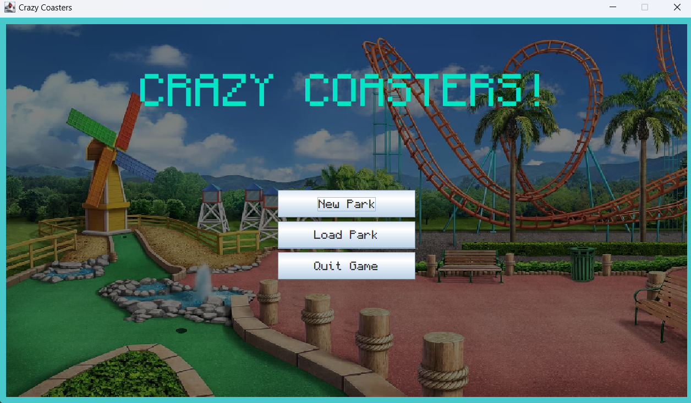
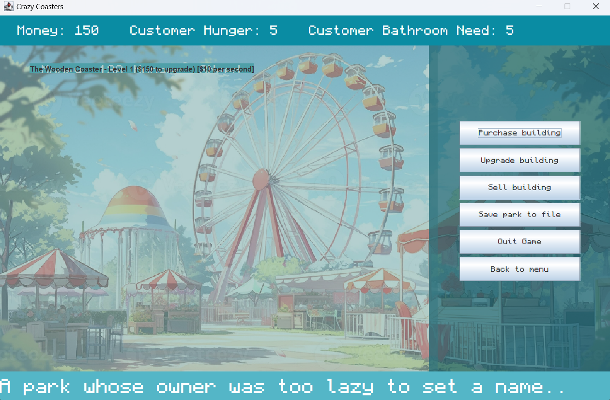

# **Crazy Coasters!**

### *Create the amusement park of your dreams!*





## Proposal!

### What will this application do?

- This application is a video game, similar to many of the idle games seen on the internet such as Cookie Clicker.
In this Amusement Park Simulator, you are the owner of your very own *amusement park*. 

- Players can build various rides,
do business, and expand their amusement park! Of course, money doesn't come so easily, and the happiness of the customers
must also be met. Don't forget to add amenities such as bathrooms and food stalls to meet the customer needs.

### Who will use this application?

- People who want to play a game that involves building their own amusement park!

### Why is this project of interest to me?

- I enjoyed playing idle games as a kid, and watching my wealth increase as the game progressed.
I also wanted to try building a game from scratch on my own. I think it will be quite enjoyable
to be able to customize and code an idle game.

## User Stories!
- [x] As a user, I want to be able to create multiple amusement parks.
- [x] As a user, I want to be able to **add a building** to my amusement park.
- [x] As a user, I want to increase the money I make by **upgrading buildings**.
- [x] As a user, I want to view my progress by having a "statistics" screen,
**viewing my money and buildings**.
- [x] As a user, I want to be able to **sell buildings**. 
- [ ] As a user, I want to be able to **acquire achievements** for progress made in the game.
- [x] As a user, I want to be able to save the current state of my game to file.
- [x] As a user, I want to be able to load the saved state of my game from file.
- [x] As a user, I want to be able to save and choose to load certain amusement parks.

## Instructions for Grader

- You can generate the first required action related to the user story "adding multiple Xs to a Y" by purchasing parks
in the ParkWindow.
- You can generate the second required action related to the user story "adding multiple Xs to a Y" by upgrading or
selling buildings in the ParkWindow screen.
- You can locate my visual component by looking at the backgrounds for the Main Menu and the ParkWindow screen, or the
background when loading in parks.
- You can save the state of my application by saving in the ParkWindow screen.
- You can reload the state of my application by loading in parks in the Main Menu. 

## Phase 4: Event Logging and Design Analysis

### Task 2: Sample Event Log

```
Amusement park "my cool park" has been created!
Mon Apr 01 01:21:14 PDT 2024
Ride "The Wooden Coaster" has been added to my cool park!
Mon Apr 01 01:21:19 PDT 2024
FoodStall "Food1" has been added to my cool park!
Mon Apr 01 01:21:51 PDT 2024
FoodStall "Food1" has been sold from my cool park!
Mon Apr 01 01:21:54 PDT 2024
Ride "The Wooden Coaster" has been upgraded to level 2!
```

### Task 3: Design Analysis and Reflection

- If I had more time to work on this project, I would refactor the original design in phase 1 to make better use of the
abstract building class. Creating the web of user menus for purchasing, upgrading, and selling buildings led to several
hundred lines of helper methods, much of which was used for checking the type of building to undergo the action.
- I would also create separate Exception classes to handle faulty user inputs for better code readability.
- I would also adjust the abstract Window class for all windows in the swing package to be able to extend it, further
adding methods such as setting up buttons, etc.